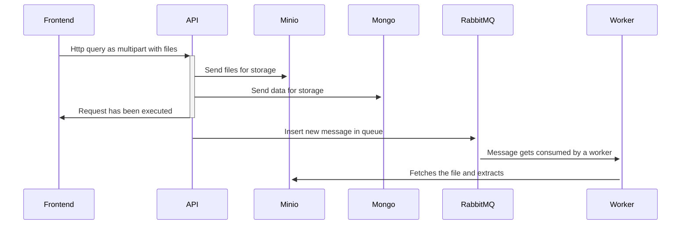
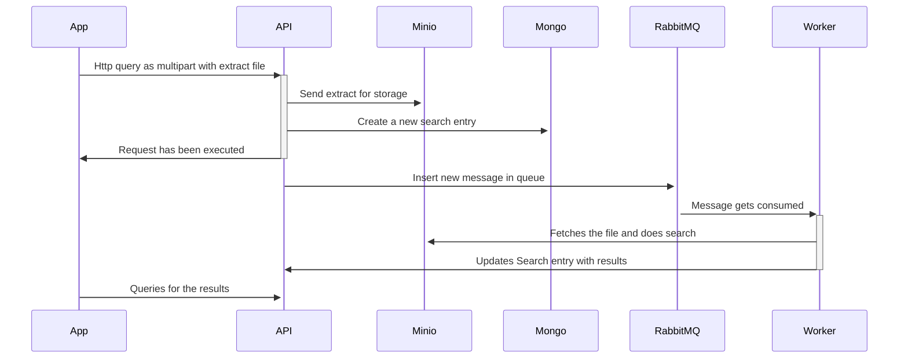

# Api Uni-verse

Uni-verse is a soundcloud-like platform that allows users to post their music, and collaborating while being protected by an anti-plagiarism system based on audio fingerprinting.

This project is Uni-verse's API and is powered by NestJS and Typescript.

Uni-verse's API is its central component, being a gateway to every other micro-services in Uni-Verse's architecture.
It interacts with :

- Stripe
- Minio
- Elastic Search
- RabbitMQ
- MongoDB

This API is meant to be hosted at [this address](https://uni-verse.api.vagahbond.com), and its auto-generated OpenAPI compliant documentation is [available here](https://uni-verse.api.vagahbond.com/docs).

## Structure des données:

### UML


### User

Every user is considered an artist before they post, to encourage creation and participation in the platform.
Before a user can publish paid resource packs, they need to get the Stripe onboarding done so that they can get paid.

### Release

A release is a list of tracks that are release together. it can be an EP, an Album, an LP, or a Single. Any released track has to be included in a release, There can be no stray track.
A release has a cover art.

### Track

A track is a song, or.. well.. a track. This entity allows retrieving the audio file for reading purpose. There are one or several Track per Release.

### Comment

Uni-verse's like/dislike system has the particularity to require a description justifying it.
The idea behind this is to encourage constructive criticism.

### ResourcePack

Uni-verse allows sharing resource packs, containing samples and VST presets.
This way, creators can exchange stems to inspire each other.
Creating a resource pack can be very demanding and that's why uni-verse allows people to sell their resource packs on the platform.

### Resource

A resource is an element of a resource pack. It ultimately is a file, whether it be a sample or a preset.
It can be previewable or not, which allows having a peek at resource packs before buying them.

### FpSearch

A fingerprint search is any search that has been done by a user in uni-verse's database. Keeping this allows making statistics. This could be implemented via Kafka in the future, for further efficiency.

### Featuring

A user can be linked to a track via this `featuring` entity. This allows making sure that credits are rightfully given: it allows linking a track with everyone that has worked on it.

### Playlist

Users can create playlists, which point to different tracks. The usual playlist feature.

### Transaction

Transations means money transaction. It can be whether the purchasing of a resource, or a donation from a user to another (that has stripe onboarding done).

## About the tech

### Typescript

The whole project is coded in typescript and ran in NodeJS, for the versatility and ease of development (let's not forget this is a POC and not a commercial product)

### NestJS

This Nest was the framework of choice for a few different reasons:

- The architecture is well defined and future-proof, which is important for such a big project.
- It allows a fait amount of scalability for the app, with extensive documentation on how to actually scale.

### Swagger

Thanks to [Swagger](https://swagger.io/docs/), we could auto-generate a documentation for this web API and save a good amount of time while being compliant to OpenAPI specifications. That documentation also has the advantage to be interactive.


### Mongoose

Uni-verse relies on Mongo DB with [Mongoose](https://mongoosejs.com/) ORM for persistence. Although it might not perform as well as a relational database for most usecases, it allowed us to get a POC working faster.

### Docker

Uni-verse's architecture is complex and has numerous components. To get a development environment working easily, we rely on [docker](https://www.docker.com/) with docker-compose. This also alows setting up the production pretty easily using docker swarm, in case of a pre-production environment, or a demo for instance.

Using docker, it's trivial to deploy images for this API on registers via CI and then pull them when needed.

### ESLint et Prettier

This API is made to be a demonstration of good software craftmanship. In this endeavour, we made use of [Eslint](https://eslint.org/) and [Prettier](https://prettier.io/) to check and enforce good practices across the codebase.

Lint and formatting checks are performed on any PR before they can be merged to the main branch.

### Kubernetes

For real production. Docker swarm might not be enough. If something load balanced and scalable is needed, kubernetes is a well-known solution.

This is why we made kubernetes deployments for this application, that create every pods needed to run Uni-Verse flawlessly, pulling it from our CI/CD generated docker registry images.

### Github Actions

As mentioned before, CI/CD plays an inportant role in this project. This is where Github Actions shines.
We leverage GH Actions on different aspects of the project:

1. Enforce best practices via Prettier and ESLint checking on each PR (no one can push to `master`)
2. Run unit and integration tests on each PR
3. Build and push the Docker images to our registries.

### Winston + Filebeat

This APi's logs are written in a file that's shared with Kibana using Filebeat so that they can be thoroughly analyzed if ever needed.
This allows having a dashboard with a good overview on what's going on in the app.

## Contributing

### Setting up the environment

Although docker-compose simplifies the reproduction of this app's environment, it does not do everything for you.
Some environment variables are needed by the app so that the production version does not spill out all of our precious secrets!

Our development environment for this API and the frontend is available in [another repo](https://github.com/uni-verse-fm/uni-verse-dev).

In this repository, you can find a `docker-compose.yml` and a `docker.env` file.

How to use all that is simple :

```bash
# Clone the repository with submodules (this one and the frontend)
git clone --recurse-submodules git@github.com:uni-verse-fm/uni-verse-dev.git

docker compose up

```

## Architecture


### Api

As a central element of the architecture, API acts as a gateway to our different services, that frontends access.

### MongoDB

MongoDB persists the most basic stuff: Users, buisness entities...
MongoDB's flexibility allowed us to get this POC running in no time.

### RabbitMQ

Audio fingerprinting is a costly operation that takes time. This is why, for scalability reasons it's good to have it made by independent workers. RabbitMQ allows having a queue of tasks that summons worker to process audio samples and output their generated fingerprints, for them to be indexed for further comparison.

### FP Worker

FingerPrinting workers are atomic entities that only exist to process audio and turn it into fingerprints. Those fingerprints are then sent to the database.

### Minio

Storing files is a tricky tasks, especially at scale. This is why we use an object storage to store pictures, resources, and tracks. Minio has the advantage of being open source and fully self hosted.

### Elastic Search

ES allows us to implement an efficient, fast, and robust search system. The user can search for other users, tracks, releases, resources, or resource packs.

### Kibana

Leveraging ES and filebeat, we can have indexed logs from the API, and search them efficiently whenever needed, this allows for great alanytics of the application, we can know exactly how it runs and what happened when it doesn not run properly.

### Filebeat

Filebeat retrieves logfiles and sends them to Kibana.

### Android app

For a music streaming platform, an Android app is an absolute must. Track retrieving via samples can also be done through that android app. It uses the same API endpoints as the frontend.

### Frontend

The frontend is made using Svelte and SSR for an optimal SEO, allowing artists to get more visibility.

### Complex interactions

#### Release upload:



#### Audio lookup via fingerprinting:



## Production

Here are the different kubernetes config files available for the production:

| Service                                                                             |                               Files |
| :---------------------------------------------------------------------------------- | ----------------------------------: |
| [Api](https://github.com/uni-verse-fm/uni-verse-api/tree/main/kubernetes/api)       | Configmap, Deployment, Service, PVC |
| [MongoDB](https://github.com/uni-verse-fm/uni-verse-api/tree/main/kubernetes/api)   |            Deployment, PVC, Service |
| RabbitMQ                                                                            |                          Helm Chart |
| [FP workers](https://github.com/uni-verse-fm/uni-verse-worker)                      |            PVC, Service, Deployment |
| Elastic search                                                                      |                          Helm Chart |
| FileBeat                                                                            |                           Daemonset |
| Kibana                                                                              |                          Helm Chart |
| MinIO                                                                               |                          Helm Chart |
| (Frontend)[https://github.com/uni-verse-fm/uni-verse-frontend/tree/main/kubernetes] |                 Deployment, Service |
