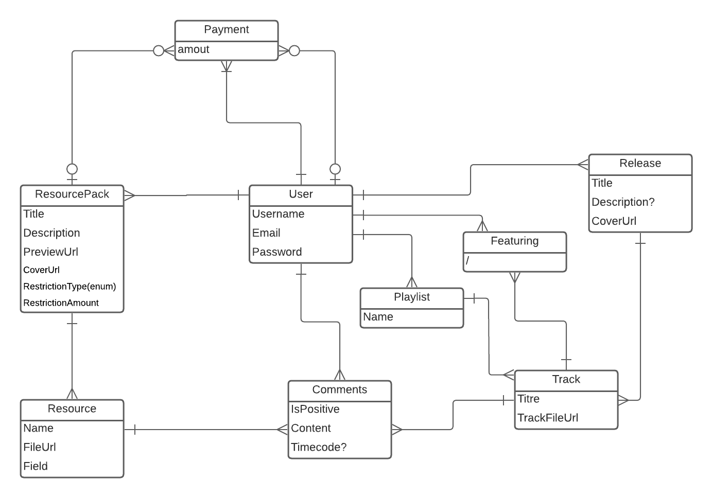
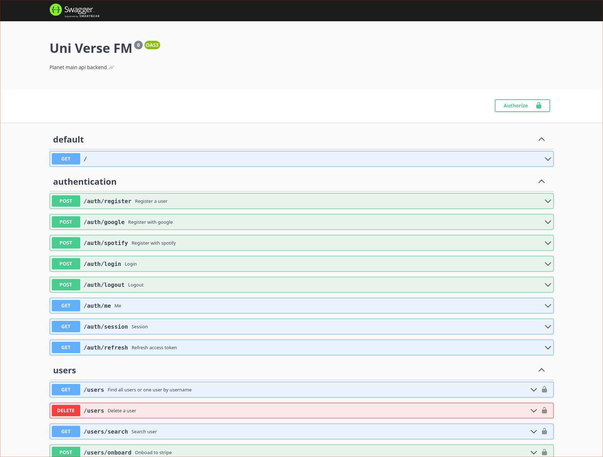
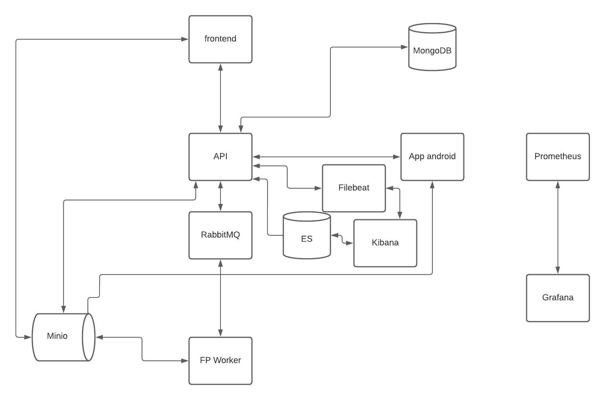
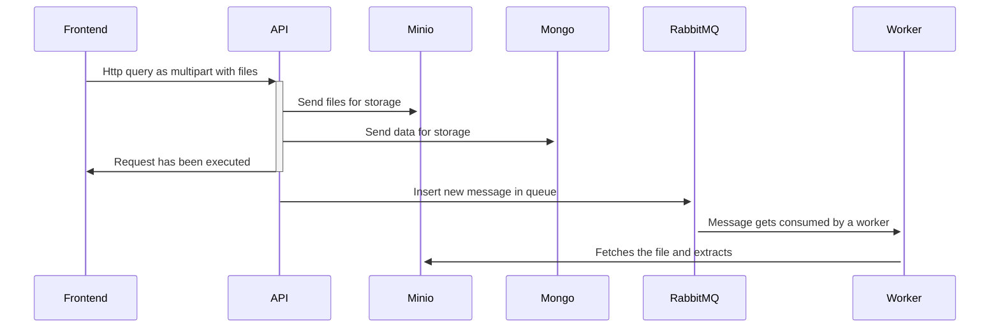
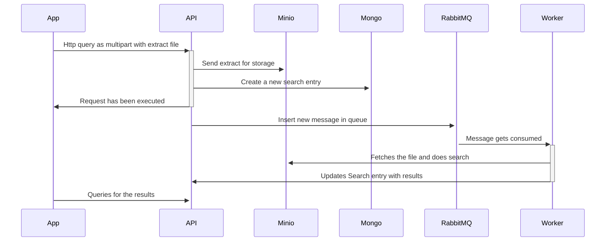

# Api Uni-verse

Uni-verse is a soundcloud-like platform that allows users to post their music, and collaborating while being protected by an anti-plagiarism system based on audio fingerprinting.

This project is Uni-verse's API and is powered by NestJS and Typescript.

Uni-verse's API is its central component, being a gateway to every other micro-services in Uni-Verse's architecture.
It interacts with :

- Stripe
- Minio
- Elastic Search
- RabbitMQ
- MongoDB

This API is meant to be hosted at [this address](https://uni-verse.api.vagahbond.com), and its auto-generated OpenAPI compliant documentation is [available here](https://uni-verse.api.vagahbond.com/docs).

## Structure des données:

### UML



### User

Every user is considered an artist before they post, to encourage creation and participation in the platform.
Before a user can publish paid resource packs, they need to get the Stripe onboarding done so that they can get paid.

### Release

A release is a list of tracks that are release together. it can be an EP, an Album, an LP, or a Single. Any released track has to be included in a release, There can be no stray track.
A release has a cover art.

### Track

A track is a song, or.. well.. a track. This entity allows retrieving the audio file for reading purpose. There are one or several Track per Release.

### Comment

Uni-verse's like/dislike system has the particularity to require a description justifying it.
The idea behind this is to encourage constructive criticism.

### ResourcePack

Uni-verse allows sharing resource packs, containing samples and VST presets.
This way, creators can exchange stems to inspire each other.
Creating a resource pack can be very demanding and that's why uni-verse allows people to sell their resource packs on the platform.

### Resource

A resource is an element of a resource pack. It ultimately is a file, whether it be a sample or a preset.
It can be previewable or not, which allows having a peek at resource packs before buying them.

### FpSearch

A fingerprint search is any search that has been done by a user in uni-verse's database. Keeping this allows making statistics. This could be implemented via Kafka in the future, for further efficiency.

### Featuring

A user can be linked to a track via this `featuring` entity. This allows making sure that credits are rightfully given: it allows linking a track with everyone that has worked on it.

### Playlist

Users can create playlists, which point to different tracks. The usual playlist feature.

### Transaction

Transations means money transaction. It can be whether the purchasing of a resource, or a donation from a user to another (that has stripe onboarding done).

## About the tech

### Typescript

The whole project is coded in typescript and ran in NodeJS, for the versatility and ease of development (let's not forget this is a POC and not a commercial product)

### NestJS

This Nest was the framework of choice for a few different reasons:

- The architecture is well defined and future-proof, which is important for such a big project.
- It allows a fait amount of scalability for the app, with extensive documentation on how to actually scale.

### Swagger

Thanks to [Swagger](https://swagger.io/docs/), we could auto-generate a documentation for this web API and save a good amount of time while being compliant to OpenAPI specifications. That documentation also has the advantage to be interactive.



### Mongoose

L'API de Uni-verse repose sur une base de données MongoDB et communique avec via l'ORM [Mongoose](https://mongoosejs.com/).

### Docker

Ce produit est distribué par le biais d'une image [docker](https://www.docker.com/), construite dans une pipeline Github-Actions et publiée dans un registre privé docker.
L'image docker permet de repliquer l'environnement dont Uni-verse a besoin en une seule commande, et de l'utiliser plus facilement sur le cloud.

### ESLint et Prettier

Afin d'enforcer les conventions de codage, [Eslint](https://eslint.org/) et [Prettier](https://prettier.io/) ont été mis en place et intégré dans GitHub-Actions.

### Kubernetes

Des deploiements, services, volumes claims et une configmap dans ce répo permettent de déployer facilement cette infrastructure en production dans Kubernetes.

### Github Actions

Github-Actions est utilisé pour plusieur aspects du projet:

1. Faire respecter les conventions de code en faisant tourner prettier et eslint sur chaque PR
2. Faire tourner les tests sur chaque PR et chaque nouveau commit dans `main`
3. Construire l'image docker et la publeir dans le registre privé à chaque release créée sur Github.

### Winston + Filebeat

Les logs de l'API sont écrites en continue dans un fichier, partagé sous forme de volume avec une instance FileBeat qui récupère les logs et les envoit à Kibana sous un format spécifiques, afin qu'elles soient accessibles depuis un dashboard.

## Contribuer

### Environnement de développement

Afin de developper localement, un docker-compose a été mis en place et permet de simuler toute l'architectuer du projet, avec ses differents composants.

Pour développer sur ce projet, il faut remplir `docker.env` avec les variables suivantes :

```
ME_CONFIG_MONGODB_SERVER=mongodb
ME_CONFIG_MONGODB_ADMINUSERNAME=root
ME_CONFIG_MONGODB_ADMINPASSWORD=pass
ME_CONFIG_BASICAUTH_USERNAME=root
ME_CONFIG_BASICAUTH_PASSWORD=pass
MONGO_INITDB_ROOT_USERNAME=root
MONGO_INITDB_ROOT_PASSWORD=pass
MONGO_INITDB_DATABASE=db
MONGO_HOSTNAME=mongodb
MONGO_USERNAME=root
MONGO_PASSWORD=pass
MONGO_PORT=27017
MONGO_DATABASE=uniVerse
PORT=3000
JWT_ACCESS_TOKEN_SECRET=uniVerseJwtSecret
JWT_ACCESS_TOKEN_EXPIRATION_TIME=60s
JWT_REFRESH_TOKEN_SECRET= uniVerseJwtSecret
JWT_REFRESH_TOKEN_EXPIRATION_TIME= 24h
MINIO_ROOT=miniokey
MINIO_ROOT_USER=root
MINIO_ROOT_PASSWORD=miniosecret
MINIO_ENDPOINT=minio
MINIO_PORT=9000
FRONTEND_URL=http://localhost:3005
GF_SECURITY_ADMIN_USER=admin
GF_SECURITY_ADMIN_PASSWORD=pass
ELASTIC_USERNAME=elastic
ELASTIC_PASSWORD=admin
ELASTICSEARCH_NODE=http://elasticsearch:9200
RMQ_URL=rabbitmq
RMQ_PORT=5672
IN_QUEUE_NAME=uni-verse-fp-in
INTERNAL_API_HOST=dev
INTERNAL_API_PORT=3000
RMQ_URL=rabbitmq
RMQ_PORT=5672
RMQ_USER=guest
RMQ_PASSWORD=guest
ONBOARD_REFRESH_URL=https://uni-verse.api.vagahbond.com/payments/refresh
STRIPE_WEBHOOK_SECRET=

```

L'API refusera de démarrer s'il remarque qu'il lui manque des variables.

Une fois les variables en place, il suffit de lancer la stack avec `docker-compose up`.

## Architecture



### Api

Element central de l'architecture, l'API est au centre de tous les échanges de données.

### MongoDB

Base de donnée utilisée par l'API afin de sauvegarder ses modèles. La base de donnée document, dans le cas de uni-verse, offre des avantages en terme d'implementation.

### RabbitMQ

RabbitMQ est utilisé dans cette stack en tant que queue d'instructions, dans un style emetteur-consommateur: l'API emmet des messages qui sont consommés par les FP-workers, qui eux memes font appel à l'API quand ils ont fini.

### FP Worker

Les FP workers sont des pods contenant un code simple qui sont executés dans le but de générer l'empreinte d'un fichier audio, ou d'effectuer une recherche par empreinte. Une fois le resultat d'une recherche obtenue, une requete est faite pour mettre à jour l'etat de la recherche dans la base.

### Minio

Minio sert à stocker tous les fichiers, qu'il s'agisse d'images, de fichiers sons, ou autres.

### Elastic Search

Elastick search permet, grâce à des indexes, de faire des recherches rapides et optimisées de contenu.

### Kibana

Kibana permet d'avoir une interface en lien direct avec Elastic search, et avec Filebeat. De cette façon on peut consulter les index créés par l'API, ainsi que les logs récoltés par Filebeat.

### Filebeat

Filebeat permet de reecupérer des logs dans un fichier, et de les envoyer automatiquement à Kibana.

### Android app

L'applicaiton android se connecte à l'API et à Minio, et permet aux utilisateurs d'écouter la musique disponible sur la plateforme.

### Frontend

Le frontend permet de mettre en ligne et consulter les tracks et ressources.

### Séquences importantes

#### Upload d'une release:



#### Recherche par fingerprint audio:



### Conventions de codage

Les conventions de codage poussées par Prettier et ESLint sont basées sur les configurations recommendées directement par l'écosystème NodeJS. On peut les consulter [dans la documentation de eslint typescript](https://typescript-eslint.io/docs/linting/configs).

Les règles prncipales à retenir sont que les variables doivent être en lowerCamelCase, ainsi que les fonctions. Eslint veille aussi aux imports et variables non utilisees.

Si les conventions de codage ne sont pas respectées, une PR ne peut pas être mergée, car elle ne passera pas les tests de l'intégration continue.

## Production

### Api

Pour l'API, ce répos fournis un volume (pour les logs), une configmap, un déploiement et un service.

### MongoDB

Pour MongoDB, ce répos fournit un volume, un déploiement et un service.

### RabbitMQ

RabbitMQ est disponible sous forme de Helm chart, s'installant sans configuration.

### FP Worker

Les workers uni-verse sont fournsi sous forme de volume, service et déploiement dans [leur répos](https://github.com/uni-verse-fm/uni-verse-worker).

### ES

Elastic Search est disponible sous forme de Helm Chart permettant l'installation d'un cluster scalable assez rapidement.

### Filebeat

Filebeat fonctionne grâce à un daemonset qui maintient un pod en vie. Ce pod partage son volume avec l'API, afin de récupérer ses logs

### Kibana

Kibana est disponible sous forme de Helm Chart, assez facile à configurer à l'aide d'options.

### Prometheus + Grafana

Prometheus et grafana sont tous deux disponibles sous forme de Helm chart, ce qui permet une isntallation rapide de ceux-ci.

### Minio

Minio aussi est disponible sous forme de Helm chart. Il est préférable de l'utiliser car il s'agit d'une installation complexe et scallable sur plusieur serveurs en fonction de la demande.

### Frontend

Le frontend contient des fichiers permettant de le mettre en production dans [son répos](https://github.com/uni-verse-fm/uni-verse-frontend).
