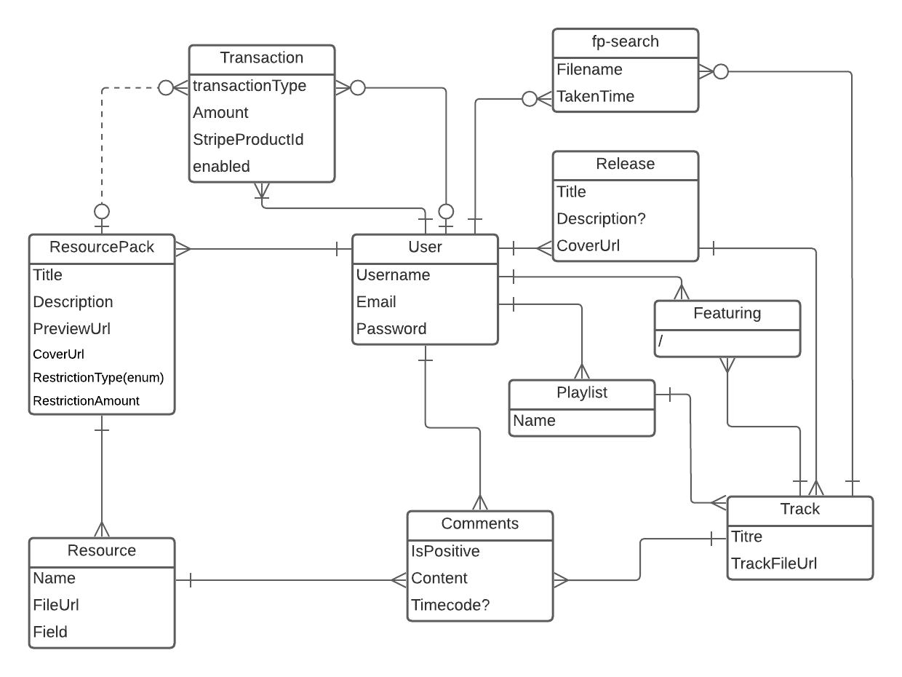

# Api Uni-verse

Uni-verse est une plateforme de streaming audio conçue spécifiquement pour les producteurs de musique.
Elle consiste en un site web, une application smartphone, et une API.

Ce projet est l'api de Uni-verse.

Cette API est l'element central de l'infrastructure de Uni-Verse. En effet, toutes les données transitent par cet element.

Actuellement, l'API est en ligne à l'[addresse suivante](https://uni-verse.api.vagahbond.com), et sa documentation Swagger à l'[addresse suivante](https://uni-verse.api.vagahbond.com/docs)

## Structure des données:

### UML


### User
Représente un utilisateur de la plateforme. Tous les utilisateurs sont considérés comme des producteurs et sont suceptibles de publier des musiques et des ressources. Il est toutefois necessaire de faire l'onboarding Stripe afin de rendre disponible des ressources payantes.
### Release
Une release est une liste de tracks qui vont ensemble. Il peut s'agir d'un EP, d'un album, d'un LP, voire même d'un single. Toute track est publiée dans une release, qui doit avoir une couverture.
### Track
Une track est une musique, une chanson. L'entité `track` a pour premier but de pointer vers un fichier que l'on peut lire.
### Comment
Dans Uni-verse, il est possible de mettre un "like" ou un "dislike" mais il doit être justifié. Un pouce en l'air ou vers le bas doit être accompagné d'un commentaire.
### ResourcePack
Un pack de ressources est un package qui contient plusieurs ressources. Ces ressources sont soit des samples (court fichier son que l'on ajoute à sa musique), soit des presets que l'on peut charger dans l'editeur de musique.
### Resource
Une ressource est une partie d'un ressource pack. Il s'agit d'un fichier, que ce soit un fichier son ou un fichier de réglage de plugin de logiciel audio.
### FpSearch
Une recherche par fingerprint est une recherche qui a été effectuée par un utilisateur dans la base de uni-verse. On en garde la trace afin de pouvoir faire des statistiques sur le taux de reussite dnas le futur.
### Featuring
Un utilisateur peut être relié a une track par le biais de l'entité "featuring". Cela indique qu'il a travaillé sur cette track avec son auteur.
### Playlist
Il est possible de créer des playlists, qui contiennent une liste de tracks.
### Transaction
Une transaction représente un achat de resourcepack, ou un don fait par un utilisateur à un autre utilisateur.

## Stack technique

### Typescript
Pour l'API de uni-verse, nous avons choisi d'utiliser NodeJS avec Typescript pour la maintenabilité.

### NestJS
L'API pour nest est basé sur [NestJS](https://docs.nestjs.com/). Sa structure prédéfinie et sa flexibilité dans la créaction de services et de middlewares permet de gagner du temps dans le développement, et d'avoir rapidement un API prêt pour la production.
### Swagger
La documentation de l'API est générée à l'aide de [Swagger](https://swagger.io/docs/). Swagger permet une automatisation rapide et pratique de la documentation, sans sacrifier la qualité puisqu'il permet de faire enormement de choses, comme rendrela documentation interactive.


### Mongoose
L'API de Uni-verse repose sur une base de données MongoDB et communique avec via l'ORM [Mongoose](https://mongoosejs.com/).

### Docker
Ce produit est distribué par le biais d'une image [docker](https://www.docker.com/), construite dans une pipeline Github-Actions et publiée dans un registre privé docker.
L'image docker permet de repliquer l'environnement dont Uni-verse a besoin en une seule commande, et de l'utiliser plus facilement sur le cloud.

### ESLint et Prettier
Afin d'enforcer les conventions de codage, [Eslint](https://eslint.org/) et [Prettier](https://prettier.io/) ont été mis en place et intégré dans GitHub-Actions.

### Kubernetes
Des deploiements, services, volumes claims et une configmap dans ce répo permettent de déployer facilement cette infrastructure en production dans Kubernetes.

### Github Actions
Github-Actions est utilisé pour plusieur aspects du projet:
1) Faire respecter les conventions de code en faisant tourner prettier et eslint sur chaque PR
2) Faire tourner les tests sur chaque PR et chaque nouveau commit dans `main`
3) Construire l'image docker et la publeir dans le registre privé à chaque release créée sur Github.

### Winston + Filebeat
Les logs de l'API sont écrites en continue dans un fichier, partagé sous forme de volume avec une instance FileBeat qui récupère les logs et les envoit à Kibana sous un format spécifiques, afin qu'elles soient accessibles depuis un dashboard.


## Contribuer

### Environnement de développement
Afin de developper localement, un docker-compose a été mis en place et permet de simuler toute l'architectuer du projet, avec ses differents composants.

Pour développer sur ce projet, il faut remplir `docker.env` avec les variables suivantes :
```
ME_CONFIG_MONGODB_SERVER=mongodb
ME_CONFIG_MONGODB_ADMINUSERNAME=root
ME_CONFIG_MONGODB_ADMINPASSWORD=pass
ME_CONFIG_BASICAUTH_USERNAME=root
ME_CONFIG_BASICAUTH_PASSWORD=pass
MONGO_INITDB_ROOT_USERNAME=root
MONGO_INITDB_ROOT_PASSWORD=pass
MONGO_INITDB_DATABASE=db
MONGO_HOSTNAME=mongodb
MONGO_USERNAME=root
MONGO_PASSWORD=pass
MONGO_PORT=27017
MONGO_DATABASE=uniVerse
PORT=3000
JWT_ACCESS_TOKEN_SECRET=uniVerseJwtSecret
JWT_ACCESS_TOKEN_EXPIRATION_TIME=60s
JWT_REFRESH_TOKEN_SECRET= uniVerseJwtSecret
JWT_REFRESH_TOKEN_EXPIRATION_TIME= 24h
MINIO_ROOT=miniokey
MINIO_ROOT_USER=root
MINIO_ROOT_PASSWORD=miniosecret
MINIO_ENDPOINT=minio
MINIO_PORT=9000
FRONTEND_URL=http://localhost:3005
GF_SECURITY_ADMIN_USER=admin
GF_SECURITY_ADMIN_PASSWORD=pass
ELASTIC_USERNAME=elastic
ELASTIC_PASSWORD=admin
ELASTICSEARCH_NODE=http://elasticsearch:9200
RMQ_URL=rabbitmq
RMQ_PORT=5672
IN_QUEUE_NAME=uni-verse-fp-in
INTERNAL_API_HOST=dev
INTERNAL_API_PORT=3000
RMQ_URL=rabbitmq
RMQ_PORT=5672
RMQ_USER=guest
RMQ_PASSWORD=guest
ONBOARD_REFRESH_URL=https://uni-verse.api.vagahbond.com/payments/refresh
STRIPE_WEBHOOK_SECRET=

```
L'API refusera de démarrer s'il remarque qu'il lui manque des variables.

Une fois les variables en place, il suffit de lancer la stack avec `docker-compose up`.

## Architecture

### Api
Element central de l'architecture, l'API est au centre de tous les échanges de données.
### MongoDB
Base de donnée utilisée par l'API afin de sauvegarder ses modèles. La base de donnée document, dans le cas de uni-verse, offre des avantages en terme d'implementation.
### RabbitMQ
RabbitMQ est utilisé dans cette stack en tant que queue d'instructions, dans un style emetteur-consommateur: l'API emmet des messages qui sont consommés par les FP-workers, qui eux memes font appel à l'API quand ils ont fini.
### FP Worker
Les FP workers sont des pods contenant un code simple qui sont executés dans le but de générer l'empreinte d'un fichier audio, ou d'effectuer une recherche par empreinte. Une fois le resultat d'une recherche obtenue, une requete est faite pour mettre à jour l'etat de la recherche dans la base.
### Minio
Minio sert à stocker tous les fichiers, qu'il s'agisse d'images, de fichiers sons, ou autres.

### Elastic Search
Elastick search permet, grâce à des indexes, de faire des recherches rapides et optimisées de contenu.
### Kibana
Kibana permet d'avoir une interface en lien direct avec Elastic search, et avec Filebeat. De cette façon on peut consulter les index créés par l'API, ainsi que les logs récoltés par Filebeat.
### Filebeat
Filebeat permet de reecupérer des logs dans un fichier, et de les envoyer automatiquement à Kibana.
### Android app
L'applicaiton android se connecte à l'API et à Minio, et permet aux utilisateurs d'écouter la musique disponible sur la plateforme.
### Frontend
Le frontend permet de mettre en ligne et consulter les tracks et ressources.


### Séquences importantes
#### Upload d'une release:


#### Recherche par fingerprint audio:


### Conventions de codage
Les conventions de codage poussées par Prettier et ESLint sont basées sur les configurations recommendées directement par l'écosystème NodeJS. On peut les consulter [dans la documentation de eslint typescript](https://typescript-eslint.io/docs/linting/configs).

Les règles prncipales à retenir sont que les variables doivent être en lowerCamelCase, ainsi que les fonctions. Eslint veille aussi aux imports et variables non utilisees.

Si les conventions de codage ne sont pas respectées, une PR ne peut pas être mergée, car elle ne passera pas les tests de l'intégration continue.

## Production

### Api
Pour l'API, ce répos fournis un volume (pour les logs), une configmap, un déploiement et un service.

### MongoDB
Pour MongoDB, ce répos fournit un volume, un déploiement et un service.

### RabbitMQ
RabbitMQ est disponible sous forme de Helm chart, s'installant sans configuration.

### FP Worker
Les workers uni-verse sont fournsi sous forme de volume, service et déploiement dans [leur répos](https://github.com/uni-verse-fm/uni-verse-worker).

### ES
Elastic Search est disponible sous forme de Helm Chart permettant l'installation d'un cluster scalable assez rapidement.

### Filebeat
Filebeat fonctionne grâce à un daemonset qui maintient un pod en vie. Ce pod partage son volume avec l'API, afin de récupérer ses logs

### Kibana
Kibana est disponible sous forme de Helm Chart, assez facile à configurer à l'aide d'options.

### Prometheus + Grafana
Prometheus et grafana sont tous deux disponibles sous forme de Helm chart, ce qui permet une isntallation rapide de ceux-ci.

### Minio
Minio aussi est disponible sous forme de Helm chart. Il est préférable de l'utiliser car il s'agit d'une installation complexe et scallable sur plusieur serveurs en fonction de la demande.

### Frontend
Le frontend contient des fichiers permettant de le mettre en production dans [son répos](https://github.com/uni-verse-fm/uni-verse-frontend).